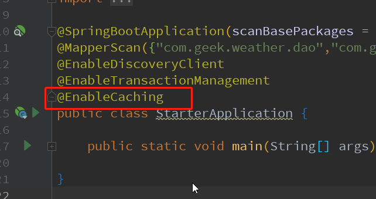

```xml
    <!-- https://mvnrepository.com/artifact/com.github.ben-manes.caffeine/caffeine -->
    <dependency>
        <groupId>com.github.ben-manes.caffeine</groupId>
        <artifactId>caffeine</artifactId>
        <version>2.8.1</version>
    </dependency>
    <dependency>
        <groupId>org.springframework.boot</groupId>
        <artifactId>spring-boot-starter-cache</artifactId>
    </dependency>
```

1、首先配置使用哪种缓存，因为spring Boot集成了大部分主流的cache
```java
package com.geek.weather.common.config;

import com.geek.weather.common.enums.CaffeineCacheEnum;
import com.geek.weather.common.utils.CaffeineCacheManageEnum;
import com.github.benmanes.caffeine.cache.CacheLoader;
import lombok.extern.slf4j.Slf4j;
import org.springframework.cache.CacheManager;
import org.springframework.cache.caffeine.CaffeineCache;
import org.springframework.cache.support.SimpleCacheManager;
import org.springframework.context.annotation.Bean;
import org.springframework.context.annotation.Configuration;
import org.springframework.context.annotation.Primary;

import java.util.ArrayList;
import java.util.List;

/**
 * @author qubianzhong
 * @date 2020/5/15 11:32
 */
@Configuration
@Slf4j
public class LocalCacheConfig {

    /**
     * 创建基于Caffeine的Cache Manager
     */
    @Bean
    @Primary
    public CacheManager caffeineCacheManager() {
        SimpleCacheManager cacheManager = new SimpleCacheManager();
        CaffeineCacheEnum[] cacheEnums = CaffeineCacheEnum.values();
        List<CaffeineCache> cacheList = new ArrayList<>(cacheEnums.length);
        for (CaffeineCacheEnum cacheEnum : cacheEnums) {
            cacheList.add(new CaffeineCache(cacheEnum.getName(),
                    CaffeineCacheManageEnum.INSTANCE.getCache(cacheEnum)));
        }
        cacheManager.setCaches(cacheList);

        return cacheManager;
    }

    /**
     * 当失效策略选择了 refreshAfterWrite 时，此处生效
     * Caffeine在缓存过期时默认只有一个线程去加载数据，
     * 配置了refreshAfterWrite后当大量请求过来时，
     * 可以确保其他用户快速获取响应。
     * 但refreshAfterWrite本身默认刷新也是同步的，
     * 也就意味着该调用者的线程还会处于等待状态，如有对于响应要求比较高时，
     * 可以改写reaload方法让它也异步去执行。
     */
    @Bean
    public CacheLoader<Object, Object> cacheLoader() {
        CacheLoader<Object, Object> cacheLoader = new CacheLoader<Object, Object>() {
            @Override
            public Object load(Object key) {
                log.info("load key:{}", key);
                return null;
            }

            @Override
            public Object reload(Object key, Object oldValue) {
                log.info("reload key:{},oldValue:{}", key, oldValue);
                return oldValue;
            }
        };
        return cacheLoader;
    }
}

```

```java
package com.geek.weather.common.utils;

import com.geek.framework.core.exception.FacadeException;
import com.geek.weather.common.enums.CaffeineCacheEnum;
import com.geek.weather.common.enums.CaffeineCacheFailureStrageEnum;
import com.geek.weather.common.enums.CaffeineValueRefrenceEnum;
import com.github.benmanes.caffeine.cache.Cache;
import com.github.benmanes.caffeine.cache.Caffeine;

import java.util.concurrent.ConcurrentHashMap;
import java.util.concurrent.TimeUnit;

/**
 * @author qubianzhong
 * @date 2020/5/15 9:10
 */
public enum CaffeineCacheManageEnum {
    /**
     * 单例 管理caffeine的cache
     */
    INSTANCE;

    private ConcurrentHashMap<String, Cache> cacheManage;

    CaffeineCacheManageEnum() {
        cacheManage = new ConcurrentHashMap<>();
    }

    public Cache<Object, Object> getCache(CaffeineCacheEnum cacheEnum) {
        if (cacheEnum == null) {
            throw new FacadeException("caffeine cache 不能为空");
        }

        Cache cache = cacheManage.get(cacheEnum.getName());
        if (cache != null) {
            return cache;
        }
        Caffeine caffeine = Caffeine.newBuilder()
                .initialCapacity(cacheEnum.getInitialCapacity())
                .maximumSize(cacheEnum.getMaximumSize());
        //初始化失效策略
        long duration = cacheEnum.getDuration();
        TimeUnit durationUnit = cacheEnum.getDurationTimeUnit();
        if (CaffeineCacheFailureStrageEnum.EXPIRE_AFTER_ACCESS.equals(cacheEnum.getFailureStrageEnum())) {
            caffeine.expireAfterAccess(duration, durationUnit);
        } else if (CaffeineCacheFailureStrageEnum.EXPIRE_AFTER_WRITE.equals(cacheEnum.getFailureStrageEnum())) {
            caffeine.expireAfterWrite(duration, durationUnit);
        } else if (CaffeineCacheFailureStrageEnum.REFRESH_AFTER_WRITE.equals(cacheEnum.getFailureStrageEnum())) {
            caffeine.refreshAfterWrite(duration, durationUnit);
        }
        //key是否使用弱引用
        if (cacheEnum.getWeakKeys() != null && cacheEnum.getWeakKeys()) {
            caffeine.weakKeys();
        }
        //value使用软引用还是弱引用
        if (CaffeineValueRefrenceEnum.SOFT_VALUES.equals(cacheEnum.getRefrenceEnum())) {
            caffeine.softValues();
        } else if (CaffeineValueRefrenceEnum.WEAK_VALUES.equals(cacheEnum.getRefrenceEnum())) {
            caffeine.weakValues();
        }
        cache = caffeine.build();
        cacheManage.put(cacheEnum.getName(), cache);
        return cache;
    }
}

```

```java
package com.geek.weather.common.enums;

import com.geek.weather.common.constant.CaffeineCacheNameConstant;
import lombok.Getter;
import org.springframework.util.StringUtils;

import java.util.Objects;
import java.util.concurrent.TimeUnit;

/**
 * caffeine中的缓存枚举
 *
 * @author qubianzhong
 * @date 2020/5/14 17:58
 */
@Getter
public enum CaffeineCacheEnum {
    /**
     * caffeine中的缓存枚举
     */
    ////////////////////活跃接口数据缓存////////////////////
    API_DATA_GROUP(CaffeineCacheNameConstant.API_DATA_GROUP,
            "获取天气组合接口",
            CaffeineCacheFailureStrageEnum.EXPIRE_AFTER_WRITE,
            10L, TimeUnit.MINUTES, 1, 3),
    API_TODAY(CaffeineCacheNameConstant.API_TODAY,
            "获取当天天气数据",
            CaffeineCacheFailureStrageEnum.EXPIRE_AFTER_WRITE,
            10L, TimeUnit.MINUTES, 5000),
    API_TODAY_V2(CaffeineCacheNameConstant.API_TODAY_V2,
            "获取当天天气数据V2",
            CaffeineCacheFailureStrageEnum.EXPIRE_AFTER_WRITE,
            10L, TimeUnit.MINUTES, 5000),
    API_FORECAST_VIDEO(CaffeineCacheNameConstant.API_FORECAST_VIDEO,
            "获取天气预报视频",
            CaffeineCacheFailureStrageEnum.EXPIRE_AFTER_WRITE,
            10L, TimeUnit.MINUTES, 1, 1),
    API_WEATHER_REAL_TIME(CaffeineCacheNameConstant.API_WEATHER_REAL_TIME,
            "根据地区code获取实时天气",
            CaffeineCacheFailureStrageEnum.EXPIRE_AFTER_WRITE,
            10L, TimeUnit.MINUTES, 10),
    API_LAST_VERSION_NEW(CaffeineCacheNameConstant.API_LAST_VERSION_NEW,
            "获取最新版本",
            CaffeineCacheFailureStrageEnum.EXPIRE_AFTER_WRITE,
            10L, TimeUnit.MINUTES, 10),

    ////////////////////特殊活跃数据缓存////////////////////
    WEATHER_CITY(CaffeineCacheNameConstant.WEATHER_CITY,
            "城市库",
            CaffeineCacheFailureStrageEnum.EXPIRE_AFTER_WRITE,
            30L, TimeUnit.DAYS, 5000),

    ////////////////////Redis活跃数据缓存////////////////////
    REDIS_GET_STR(CaffeineCacheNameConstant.REDIS_GET_STR,
            "redis的getString",
            CaffeineCacheFailureStrageEnum.EXPIRE_AFTER_WRITE,
            30L, TimeUnit.SECONDS, 10000),
    REDIS_MULTI_GET_STR(CaffeineCacheNameConstant.REDIS_MULTI_GET_STR,
            "redis的mgetString",
            CaffeineCacheFailureStrageEnum.EXPIRE_AFTER_WRITE,
            30L, TimeUnit.SECONDS, 5000),
    REDIS_HASH_MULTI_KEY(CaffeineCacheNameConstant.REDIS_HASH_MULTI_KEY,
            "redis的getHashMultiKey",
            CaffeineCacheFailureStrageEnum.EXPIRE_AFTER_WRITE,
            30L, TimeUnit.SECONDS, 3000),
    REDIS_GET_SET_ALL(CaffeineCacheNameConstant.REDIS_GET_SET_ALL,
            "redis的getSetAll",
            CaffeineCacheFailureStrageEnum.EXPIRE_AFTER_WRITE,
            30L, TimeUnit.SECONDS, 1000),
    REDIS_GET_HASH_ALL(CaffeineCacheNameConstant.REDIS_GET_HASH_ALL,
            "redis的getHashAll",
            CaffeineCacheFailureStrageEnum.EXPIRE_AFTER_WRITE,
            30L, TimeUnit.SECONDS, 1000),
    REDIS_NEAR_BY_LON_LAT(CaffeineCacheNameConstant.REDIS_NEAR_BY_LON_LAT,
            "redis的nearByLonLat,根据【城市的经纬度】查询城市附近的空气质量站点",
            CaffeineCacheFailureStrageEnum.EXPIRE_AFTER_WRITE,
            30L, TimeUnit.SECONDS, 1000),
    ;

    /**
     * 缓存名称
     */
    private String name;
    /**
     * 缓存描述
     */
    private String desc;
    /**
     * 拒绝策略
     */
    private CaffeineCacheFailureStrageEnum failureStrageEnum;
    /**
     * 失败策略持续时间
     */
    private Long duration;
    /**
     * 失败策略持续时间的单位
     */
    private TimeUnit durationTimeUnit;
    /**
     * 初始的缓存空间大小
     */
    private Integer initialCapacity;
    /**
     * 缓存的最大数量
     */
    private Integer maximumSize;
    /**
     * 是否开启key弱引用,true开启，false/null 不开启
     */
    private Boolean weakKeys;
    /**
     * caffeine value的引用类型
     */
    private CaffeineValueRefrenceEnum refrenceEnum;

    CaffeineCacheEnum(String name,
                      String desc,
                      CaffeineCacheFailureStrageEnum failureStrageEnum,
                      Long duration,
                      TimeUnit durationTimeUnit,
                      Integer initialCapacity,
                      Integer maximumSize,
                      Boolean weakKeys,
                      CaffeineValueRefrenceEnum refrenceEnum) {
        this.name = name;
        this.desc = desc;
        this.failureStrageEnum = failureStrageEnum;
        this.duration = duration;
        this.durationTimeUnit = durationTimeUnit;
        this.initialCapacity = initialCapacity;
        this.maximumSize = maximumSize;
        this.weakKeys = weakKeys;
        this.refrenceEnum = refrenceEnum;
    }

    CaffeineCacheEnum(String name,
                      String desc,
                      CaffeineCacheFailureStrageEnum failureStrageEnum,
                      Long duration,
                      TimeUnit durationTimeUnit,
                      Integer initialCapacity,
                      Integer maximumSize) {
        this.name = name;
        this.desc = desc;
        this.failureStrageEnum = failureStrageEnum;
        this.duration = duration;
        this.durationTimeUnit = durationTimeUnit;
        this.maximumSize = maximumSize;
        this.initialCapacity = initialCapacity;

        //初始化
        this.weakKeys = false;
        this.refrenceEnum = CaffeineValueRefrenceEnum.SOFT_VALUES;
    }

    CaffeineCacheEnum(String name,
                      String desc,
                      CaffeineCacheFailureStrageEnum failureStrageEnum,
                      Long duration,
                      TimeUnit durationTimeUnit,
                      Integer maximumSize) {
        this.name = name;
        this.desc = desc;
        this.failureStrageEnum = failureStrageEnum;
        this.duration = duration;
        this.durationTimeUnit = durationTimeUnit;
        this.maximumSize = maximumSize;

        //初始化
        this.initialCapacity = (int) (maximumSize * 0.75);
        this.weakKeys = false;
        this.refrenceEnum = CaffeineValueRefrenceEnum.SOFT_VALUES;
    }

    public static CaffeineCacheEnum getByCacheName(String cacheName) {
        if (StringUtils.isEmpty(cacheName)) {
            return null;
        }
        CaffeineCacheEnum[] cacheEnums = CaffeineCacheEnum.values();
        for (CaffeineCacheEnum cacheEnum : cacheEnums) {
            if (Objects.equals(cacheEnum.getName(), cacheName)) {
                return cacheEnum;
            }
        }
        return null;
    }
}

```





```java
    /**
     * 添加缓存，不过剔除掉获取实时数据的缓存，
     * 而且如果返回数据为空，不缓存。主要是防止恶意刷无效参数，摧毁此缓存（缓存里都是空）。
     */
    @Override
    @Cacheable(cacheNames = {CaffeineCacheNameConstant.API_DATA_GROUP}
            , key = "#areaCode+'_'+#longitude+'_'+#latitude+'_'+#keys"
            , condition = "#keys!='realTime'"
            , unless = "#result.data.size()==0")
    public DataResult<JSONObject> getBaseDataGroup(String areaCode,
                                                   String longitude,
                                                   String latitude,
                                                   String keys,
                                                   HeaderDTO headers) {
                                                   
        //..........

        return DataResult.ok(data);
    }
```


**常用注解：**
- @Cacheable
- @CachePut
- @CacheEvict
- @Caching

**@Cacheable**
@Cacheable可以标记在一个方法上，也可以标记在一个类上。当标记在一个方法上时表示该方法是支持缓存的，当标记在一个类上时则表示该类所有的方法都是支持缓存的。对于一个支持缓存的方法，Spring会在其被调用后将其返回值缓存起来，以保证下次利用同样的参数来执行该方法时可以直接从缓存中获取结果，而不需要再次执行该方法。Spring在缓存方法的返回值时是以键值对进行缓存的，值就是方法的返回结果，至于键的话，Spring又支持两种策略，默认策略和自定义策略，默认策略会根据方法名参数之类的进行计算得出，自定义的话，可以使用SPEL表达式。使用方法参数时我们可以直接使用“#参数名”或者“#p参数index”。

```java
   @Cacheable(value="users", key="#id")
   public User find(Integer id) {
      return null;
   }

   @Cacheable(value="users", key="#p0")
   public User find(Integer id) {
      return null;
   }

   @Cacheable(value="users", key="#user.id")
   public User find(User user) {
      return null;
   }

   @Cacheable(value="users", key="#p0.id")
   public User find(User user) {
      return null;
   }
```

除了上述使用方法参数作为key之外，Spring还为我们提供了一个root对象可以用来生成key。通过该root对象我们可以获取到以下信息。

|属性名称|描述|示例|
|:-:|:-:|:-:|
|methodName|当前方法名|#root.methodName|
|method|当前方法|#root.method.name|
|target|当前被调用的对象|#root.target|
|targetClass|当前被调用的对象的class|#root.targetClass|
|args|当前方法参数组成的数组|#root.args[0]|
|caches|当前被调用的方法使用的Cache|#root.caches[0].name|

当我们要使用root对象的属性作为key时我们也可以将“#root”省略，因为Spring默认使用的就是root对象的属性。如：

```java
   @Cacheable(value={"users", "xxx"}, key="caches[1].name")
   public User find(User user) {
      return null;
   }
```

**condition**
有的时候我们可能并不希望缓存一个方法所有的返回结果。通过condition属性可以实现这一功能。condition属性默认为空，表示将缓存所有的调用情形。其值是通过SpringEL表达式来指定的，当为true时表示进行缓存处理；当为false时表示不进行缓存处理，即每次调用该方法时该方法都会执行一次。如下示例表示只有当user的id为偶数时才会进行缓存。

```java
   @Cacheable(value={"users"}, key="#user.id", condition="#user.id%2==0")
   public User find(User user) {
      System.out.println("find user by user " + user);
      return user;
   }
```

**@CachePut**
在支持Spring Cache的环境下，对于使用@Cacheable标注的方法，Spring在每次执行前都会检查Cache中是否存在相同key的缓存元素，如果存在就不再执行该方法，而是直接从缓存中获取结果进行返回，否则才会执行并将返回结果存入指定的缓存中。@CachePut也可以声明一个方法支持缓存功能。与@Cacheable不同的是使用@CachePut标注的方法在执行前不会去检查缓存中是否存在之前执行过的结果，而是每次都会执行该方法，并将执行结果以键值对的形式存入指定的缓存中。
@CachePut也可以标注在类上和方法上。使用@CachePut时我们可以指定的属性跟@Cacheable是一样的。

**@CacheEvict**
@CacheEvict是用来标注在需要清除缓存元素的方法或类上的。当标记在一个类上时表示其中所有的方法的执行都会触发缓存的清除操作。@CacheEvict可以指定的属性有value、key、condition、allEntries和beforeInvocation。其中value、key和condition的语义与@Cacheable对应的属性类似。即value表示清除操作是发生在哪些Cache上的（对应Cache的名称）；key表示需要清除的是哪个key，如未指定则会使用默认策略生成的key；condition表示清除操作发生的条件。下面我们来介绍一下新出现的两个属性allEntries和beforeInvocation。

**allEntries属性**
allEntries是boolean类型，表示是否需要清除缓存中的所有元素。默认为false，表示不需要。当指定了allEntries为true时，Spring Cache将忽略指定的key。有的时候我们需要Cache一下清除所有的元素，这比一个一个清除元素更有效率。

```java
   @CacheEvict(value="users", allEntries=true)
   public void delete(Integer id) {
      System.out.println("delete user by id: " + id);
   }
```

**beforeInvocation属性**
清除操作默认是在对应方法成功执行之后触发的，即方法如果因为抛出异常而未能成功返回时也不会触发清除操作。使用beforeInvocation可以改变触发清除操作的时间，当我们指定该属性值为true时，Spring会在调用该方法之前清除缓存中的指定元素。

```java
   @CacheEvict(value="users", beforeInvocation=true)
   public void delete(Integer id) {
      System.out.println("delete user by id: " + id);
   }
```

**@Caching**
@Caching注解可以让我们在一个方法或者类上同时指定多个Spring Cache相关的注解。其拥有三个属性：cacheable、put和evict，分别用于指定@Cacheable、@CachePut和@CacheEvict。

```java
   @Caching(cacheable = @Cacheable("users"), evict = { @CacheEvict("cache2"),
         @CacheEvict(value = "cache3", allEntries = true) })
   public User find(Integer id) {
      return null;
   }
```

慎用weekKeys http://www.zhyea.com/2019/05/06/caffeinecache-weakkeys-flaw.html

